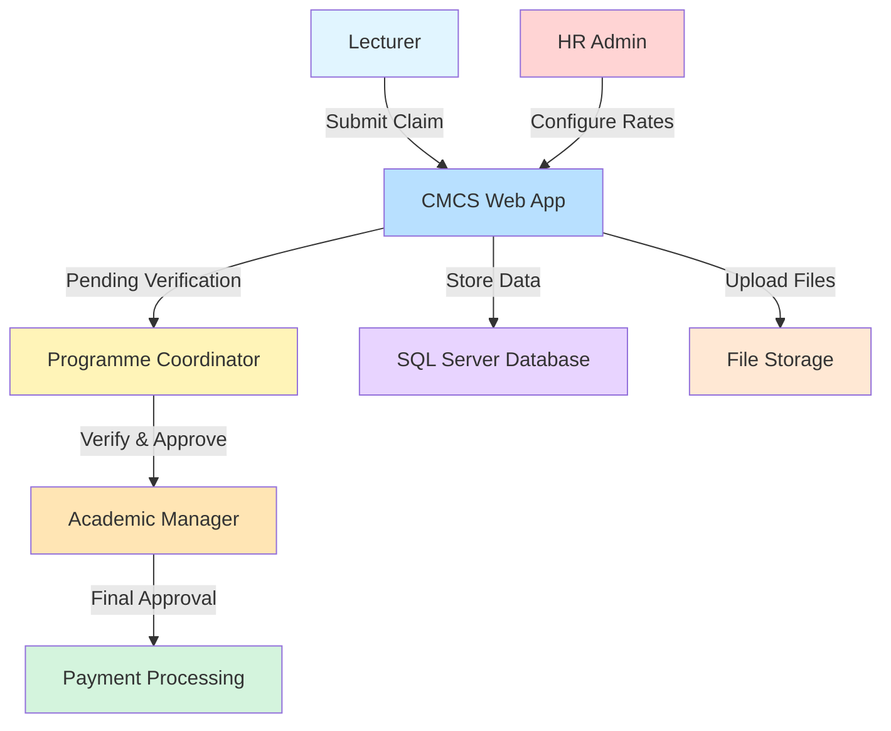

<div align="center">

# 📋 Contract Monthly Claim System (CMCS)

### *Streamlining Academic Claims with Modern Cloud Architecture*

[](https://st10434047-cmcs-crh5dhadeqc9a4fm.southafricanorth-01.azurewebsites.net)
[](https://dotnet.microsoft.com/en-us/download/dotnet/8.0)
[](https://st10434047-cmcs-crh5dhadeqc9a4fm.southafricanorth-01.azurewebsites.net/)

**[🌐 Live Application](https://st10434047-cmcs-crh5dhadeqc9a4fm.southafricanorth-01.azurewebsites.net)** • **[📖 Documentation](#documentation)** • **[🎥 Video Walkthrough](https://youtu.be/kviag0wonsE)** • **[🐛 Report Issue](https://github.com/VCCT-PROG6212-2025-G3/CMCS-ST10434047/issues)**

---

## 🎥 Project Presentation

<div align="center">
  <a href="https://youtu.be/kviag0wonsE" target="_blank">
    
  </a>
  
  **[▶️ Watch the Full Walkthrough](https://youtu.be/kviag0wonsE)**
  
  *Discover the two-stage approval workflow, role-based security, and automated calculation features*
</div>

</div>

---

## 🎯 Overview

CMCS transforms the chaotic process of managing monthly contract lecturer claims into a streamlined, automated workflow. Built for academic institutions using **ASP.NET Core MVC** and **Entity Framework Core**, this system ensures accuracy, accountability, and efficiency across the entire claims lifecycle.

### The Challenge

Traditional claim management faced critical issues:
- 📝 **Manual calculations** prone to human error
- 🔄 **Unclear approval workflows** causing delays
- 📧 **Email-based tracking** with no visibility
- 💰 **Rate inconsistencies** across departments
- 📁 **Lost documentation** and audit trail gaps

### The Solution

A comprehensive digital platform featuring:
- ⚡ **Automated calculations** based on HR-configured rates
- 🔐 **Two-stage approval** with verification and final approval
- 📊 **Real-time dashboards** showing claim status
- 👥 **Role-based access** for Lecturers, Coordinators, Managers, and HR
- 📈 **Interactive reports** with Chart.js visualizations
- 🎨 **Modern UI** with glassmorphism design language

---

## ✨ Key Features

<table>
<tr>
<td width="50%">

### 🎨 **User Experience**
- Intuitive claim submission wizard
- Real-time calculation previews
- Drag-and-drop document uploads
- Status tracking with notifications
- Mobile-responsive design
- Interactive data visualizations

</td>
<td width="50%">

### 🔧 **System Capabilities**
- Two-stage approval workflow
- Automated payment calculations
- Secure document management
- Comprehensive audit trails
- Role-based authorization
- Excel/PDF report generation

</td>
</tr>
</table>

---

## 🔑 Demo Credentials

Access the system with these pre-configured test accounts:

### 👨‍💼 HR / System Administrator
```
Name: System Administrator
Email: hr@cmcs.com
Password: Password123!
```
*Full system access: user management, hourly rate configuration, system-wide reports*

### 👔 Academic Manager
```
Name: Academic Manager
Email: manager@cmcs.com
Password: Password123!
```
*Final approval authority: review verified claims, bulk approvals, payment authorization*

### 📊 Programme Coordinator
```
Name: System Coordinator
Email: programcoordinator@cmcs.com
Password: Password123!
```
*Verification responsibilities: validate lecturer claims, request corrections, forward to manager*

### 👨‍🏫 Lecturer
```
Name: John Doe
Email: lecturer@cmcs.com
Password: Password123!
```
*Standard user access: submit claims, upload documents, track approval status*

> ⚠️ **Note:** All demo accounts use `Password123!` for testing purposes. Change credentials in production environments.

---

## 🏗️ System Architecture



### Technology Stack

| Layer | Technologies |
|:------|:-------------|
| **Backend** | C# 11, .NET 8, ASP.NET Core MVC |
| **Authentication** | ASP.NET Core Identity with role-based authorization |
| **Database** | Entity Framework Core + SQL Server LocalDB |
| **Frontend** | Bootstrap 5, Chart.js, Font Awesome, jQuery |
| **Cloud Platform** | Microsoft Azure (App Service) |
| **File Storage** | Secure document upload with validation (.pdf, .docx, .xlsx) |

---

## 🚀 Quick Start

### Prerequisites

Ensure you have the following installed:

```bash
✅ .NET 8.0 SDK or later
✅ Visual Studio 2022 (recommended) or VS Code
✅ SQL Server LocalDB (included with Visual Studio)
✅ Git
```

### Installation

1️⃣ **Clone the repository**
```bash
git clone https://github.com/VCCT-PROG6212-2025-G3/CMCS-ST10434047.git
cd CMCS-ST10434047
```

2️⃣ **Restore dependencies**
```bash
dotnet restore
```

3️⃣ **Update the database**
```bash
dotnet ef database update
```
*This creates the database schema and seeds test data*

4️⃣ **Run the application**
```bash
dotnet run
```

5️⃣ **Open your browser**
```
https://localhost:5001
```

The application is ready to use with pre-configured test accounts! 🎉

---

## 📂 Project Structure

```
CMCS/
│
├── 📁 Controllers/
│   ├── HomeController.cs              # Main navigation
│   ├── ClaimsController.cs            # Claim submission & tracking
│   ├── ApprovalController.cs          # Coordinator & Manager workflows
│   ├── HRController.cs                # User & rate management
│   └── AccountController.cs           # Authentication
│
├── 📁 Models/
│   ├── Claim.cs                       # Claim entity
│   ├── User.cs                        # User entity with roles
│   ├── HourlyRate.cs                  # Lecturer payment rates
│   ├── Document.cs                    # File metadata
│   └── ViewModels/                    # DTOs for views
│
├── 📁 Services/
│   ├── ClaimService.cs                # Business logic
│   └── DocumentService.cs             # File handling
│
├── 📁 Data/
│   ├── ApplicationDbContext.cs        # EF Core context
│   └── Migrations/                    # Database migrations
│
├── 📁 Views/
│   ├── Claims/                        # Claim submission & tracking
│   ├── Approval/                      # Coordinator & Manager views
│   ├── HR/                            # Admin dashboards
│   └── Shared/
│       ├── _Layout.cshtml            # Master layout
│       └── _LoginPartial.cshtml      # Auth navigation
│
├── 📁 wwwroot/
│   ├── css/
│   │   └── site.css                  # Custom styles with glassmorphism
│   ├── js/
│   │   └── site.js                   # Client-side validation
│   ├── lib/                          # Bootstrap, Chart.js, jQuery
│   └── uploads/                      # Uploaded documents
│
├── 📄 Program.cs                      # Application entry point
├── 📄 appsettings.json               # Configuration
└── 📄 CMCS.csproj                    # Project file
```

---

## 🎨 Design Philosophy

CMCS embraces **modern enterprise design**:

- **Glassmorphism** - Contemporary frosted glass aesthetic with backdrop blur
- **Intuitive Navigation** - Role-specific dashboards with clear action paths
- **Data Visualization** - Chart.js graphs showing claim trends and approval rates
- **Responsive Design** - Optimized for desktop, tablet, and mobile devices
- **Accessibility** - WCAG 2.1 AA compliant with semantic HTML

---

## 🔐 Two-Stage Approval Workflow

```mermaid
sequenceDiagram
    participant L as Lecturer
    participant S as System
    participant C as Coordinator
    participant M as Manager
    participant P as Payroll

    L->>S: Submit Claim + Documents
    S->>S: Auto-calculate Payment
    S->>C: Notify Pending Verification
    C->>S: Review Claim
    
    alt Verification Approved
        C->>S: Verify & Forward
        S->>M: Notify Pending Approval
        M->>S: Review Verifie
